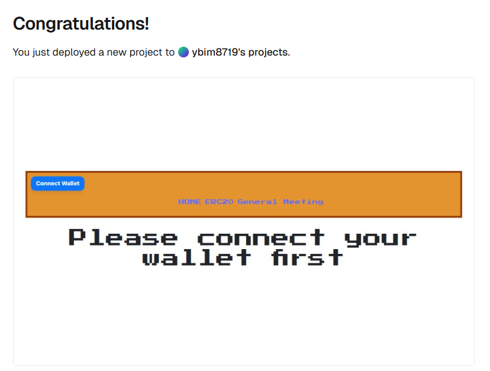
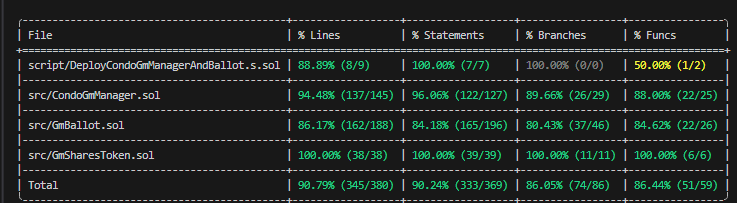
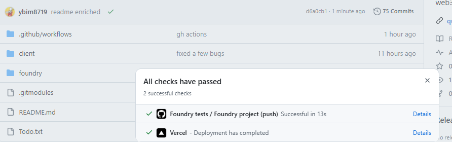
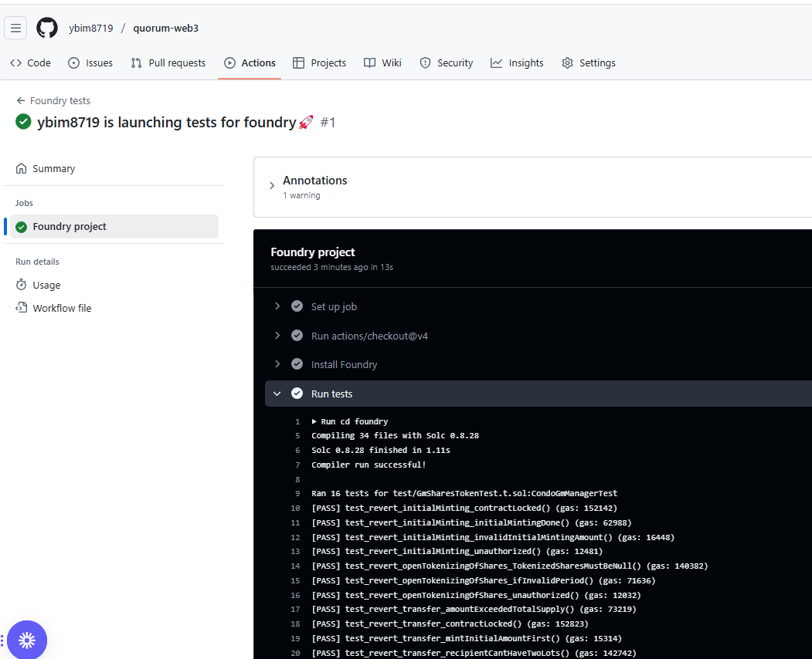

# Quorum-web3

Candidat : Pascal Thao Chanta 

Projet final de passage d'examen pour le titre de développeur blockchain (soutenance alyra du 10 avril 2025) 


## A propos du sujet: 

Quorum est une dApp destiné à la gestion au stockage de données relatives aux Assemblées générales ordinaires dans les copropriétés (AGO). Le but de cette dapp est de gérer les étapes du cycle de vie
de ce type de réunions. Donc la préparation, l'exécution et les reportings des discussions et des votes décidés en séance. 

L'objectif de ce POC est de simuler ce que pourrait être une version minimale du projet imaginé avec le groupe constitués de stagiaires de la promo consulting Blockchain. 


## Features et rôles des contrats

En utiisant le script forge associé, 2 contrats sont déployés : le **CondoGmManager**  et le **GmBallot**. 

CondoGmManager est une sorte de contrat admin qui permet à un syndic de : 

- d'ajouter des lots de copropriété
- d'ajouter des clients (qui sont les propriétaires des lots)
- de créer un ERC20 nommé et de minter un montant initial de 1000 (nombre de parts dans une copro)
- de transferer les parts (appelées tantièmes) en équivalent token aux propriétaires concernés et rattachés via leur address wallet
- de verouiiller ledit contrat ERC20 

le GmBallot est un contrat qui va stocker les propositions qui seront discutées en séances, et les votes de chacun associés. 


## Technos 
- React + RainbowKit + Wagmi + Viem + tanstackQuery (connexion wallet de browser)
- Solidity + Foundry (tests et script) + open zeppelin (ERC20 + Ownable)
- Github Actions (exécution auto des tests unitaires foundry)


## Application des bonnes pratiques solidity : 
- NatSpec
- Uitlisation du unchecked dans les boucles 
- Utilisation de mapping plutôt que des arrays 
- Elimination des contrôles superflus

## Bonnes pratiques solidity qui n'ont pas pu être implémentées : 
- State packing
- Limitation de la taille des uint

## Sécurité solidity appliquée: 
- Prévention du reentrancy avec des flags avant les call externes
- Ajout d'un fallback et receive (force feeding)

## Failles de sécurité et métiers observées : 
- Quelques fonctions view font des opérations très longues 
- Une fonction du Manager fait des call sucessifs vers un contrat externe au sein d'une boucle dans un tableau => dos gas limit
- Les fonctions transferFrom et approve héritées de ERC20.sol ne sont pas locked
- Au cours d'un scrutin, une view function permet de récupérer les suffrages exprimés alors que le vote n'est pas encore clos => failles de partialité


## Déploiements effectués : 
- Contrats déployés sur sepolia: Manager => [0x2f557407E27027e9ec580A30FD9cdB2317a41d3F](https://sepolia.etherscan.io/address/0x2f557407E27027e9ec580A30FD9cdB2317a41d3F) et Ballot =>[0x71E7Dc3B83C6600a5Af51e658f03646071bF2E92](https://sepolia.etherscan.io/address/0x71E7Dc3B83C6600a5Af51e658f03646071bF2E92)
- Front end déployé sur vercel: https://quorum-web3.vercel.app/ (pointe vers les contrats sepolia)





## Tests et CI

- Qui bénéficient de tests unitaires et de Fuzz tests



- Implémentation d'un Github actions qui trigger les T.U Foundry à chaque push sur main






## Lancer les tests avec forge : 

1. Installer forge [https://github.com/foundry-rs/foundry](https://github.com/foundry-rs/foundry).

2. Compiler les contrats: 

```shell
 cd foundry 
 forge build
```

Lancer les T.U. 

```shell
forge test
```

Rapport sur la couverture de tests: 

```shell
forge coverage
```


## Deployer le projet (3 méthodes) 

### A. Lancer le contrat et l'IHM en local :

0) Lancez Anvil :
```shell
anvil
```

1) Ajoutez le network anvil à votre Metamask et importez account0 (qui est owner du contrat dans Metamask) avec la Private key: 

```shell
0xac0974bec39a17e36ba4a6b4d238ff944bacb478cbed5efcae784d7bf4f2ff80
```
aide :
 
https://ethereum.stackexchange.com/questions/164536/how-can-i-add-anvil-token-from-the-test-token-provided-to-my-metamask-account


2) Déployez les 2 contrats sur anvil (avec le account1 d'Anvil):

Ouvrez un nouveau terminal et: 

```shell
cd foundry
```

```shell
forge script src/DeployCondoGmManagerAndBallot.s.sol  --private-key 0xac0974bec39a17e36ba4a6b4d238ff944bacb478cbed5efcae784d7bf4f2ff80 --rpc-url http://localhost:8545 --broadcast 
```

3) Installez et lancez React dans un nouveau terminal: 

```shell
cd /client
npm install
npm run dev
```
Puis allez sur : http://localhost:5173/

(L'adresse des contrats déployés sur Anvil et l'abi sont intégrés dans le code front-end)

Voici quelques addresses publiques mises à dispo par Anvil pour vos tests : 

```
- (1) 0x59c6995e998f97a5a0044966f0945389dc9e86dae88c7a8412f4603b6b78690d
- (2) 0x5de4111afa1a4b94908f83103eb1f1706367c2e68ca870fc3fb9a804cdab365a
- (3) 0x7c852118294e51e653712a81e05800f419141751be58f605c371e15141b007a6
- (4) 0x47e179ec197488593b187f80a00eb0da91f1b9d0b13f8733639f19c30a34926a
```

et les PK associées (pour import dans metamask et pour switcher d'un compte à l'autre) => à importer dans metamask

```
- (1) 0x59c6995e998f97a5a0044966f0945389dc9e86dae88c7a8412f4603b6b78690d
- (2) 0x5de4111afa1a4b94908f83103eb1f1706367c2e68ca870fc3fb9a804cdab365a
- (3) 0x7c852118294e51e653712a81e05800f419141751be58f605c371e15141b007a6
- (4) 0x47e179ec197488593b187f80a00eb0da91f1b9d0b13f8733639f19c30a34926a
```


### B. Contrats sur Sepolia et IHM sur Vercel (vous avez besoin de faucets):

Les 2 contrats ont déjà été déployés aux adresses suivantes :


```
Manager => [0x2f557407E27027e9ec580A30FD9cdB2317a41d3F](https://sepolia.etherscan.io/address/0x2f557407E27027e9ec580A30FD9cdB2317a41d3F) 
Ballot =>[0x71E7Dc3B83C6600a5Af51e658f03646071bF2E92](https://sepolia.etherscan.io/address/0x71E7Dc3B83C6600a5Af51e658f03646071bF2E92)
```

Et voici l'URL vers l'IHM déployée sur Vercel.

```
https://quorum-web3.vercel.app/
```


### C. Déployer soi-même le contrat sur Sepolia (déconseillé): 

Si vous avez un peu de faucet:

Modifiez votre .env: 

```shell
SEPOLIA_RPC_URL=<your-infura-rpc>
PRIVATE_KEY=<pk-used-to-deploy>
ETHERSCAN_API_KEY=<pk-used-to-deploy>
```

```shell
source . env 
```

Déployez en dry run : 

```shell
cd foundry
forge script script/DeployCondoGmManagerAndBallot.s.sol --private-key $PRIVATE_KEY --rpc-url $SEPOLIA_RPC_URL
```

Puis en réel : 

```shell
cd foundry
forge script script/DeployCondoGmManagerAndBallot.s.sol --private-key $PRIVATE_KEY --rpc-url $SEPOLIA_RPC_URL --broadcast
```

Vérifiez sur etherscan vos 2 contrats: 

```shell
forge verify-contract <address-du-manager-deployé>  ./src/CondoGmManager.sol:CondoGmManager --rpc-url $SEPOLIA_RPC_URL --watch
forge verify-contract <address-du-ballot-deployé>  ./src/GmBallot.sol:GMBallot --rpc-url $SEPOLIA_RPC_URL --watch
```

Changez la valeur des adresses sepolia dans :

```
quorum-web3/client/constants/deployed.ts

sepolia: {
  manager: "// replace here when deployed on sepolia",
  ballot: "// replace here when deployed on sepolia"
}
```

puis dans :

```
quorum-web3/client/src/context/globalContext.tsx
```

remplacez :
```
  const deployedManagerAddress = network.anvil.manager;
  const deployedBallotAddress = network.anvil.ballot;
```
par
```
  const deployedManagerAddress = network.sepolia.manager;
  const deployedBallotAddress = network.sepolia.ballot;
```

Et enfin lancez, react depuis votre local sur /client

```
npm run dev 
```


## Features restants à implémenter dans le futur

- Le CondoGmManager devrait plutôt gérer des lots et devenir un factory de contract ERC20Shares / Ballots 
- CRUD de customers / lots 
- Rendre le rollback possible quand on fait les transferts owner -> customer
- Vote par anticipation 
- Vote par procuration 
- Enrichissement du modèle Proposal (quorum, montants, détails, etc...)
- Gestion documentaire sur un serveur dédié (compte-rendus, convocations)
- UX/UI à revoir totalement 
- Intégration CSS ad hoc 


## Améliorations tech restantes à implémenter dans le futur

- Front : Routing un peu bancal / => système de guard par identifiant
- Front : Utitilisation du context un peu grossière 
- Front : Des composants trop gros (optimisations de hooks et découpage de composants) 
- Front : Une GH actions mieux mieux qui lance un linter + prettier côté front 
- All :Un système de precommit 
- Back : + de fuzz tests et d'invariants 
- Front : Events listener to check status changes and other logs
- Back : ERC20 : lock transferFrom && approval 
- Front : camemberts et charts de scrutins
- Back: loadSharesAndCustomersToBallot pue car ça loope sur un array qui peut causer un gas limit 
- Rules de dépouillement pas ouf
- Back : essayer Mythril et Slither


### small bug :
calling owner() deployed sepolia returns lowercase 
